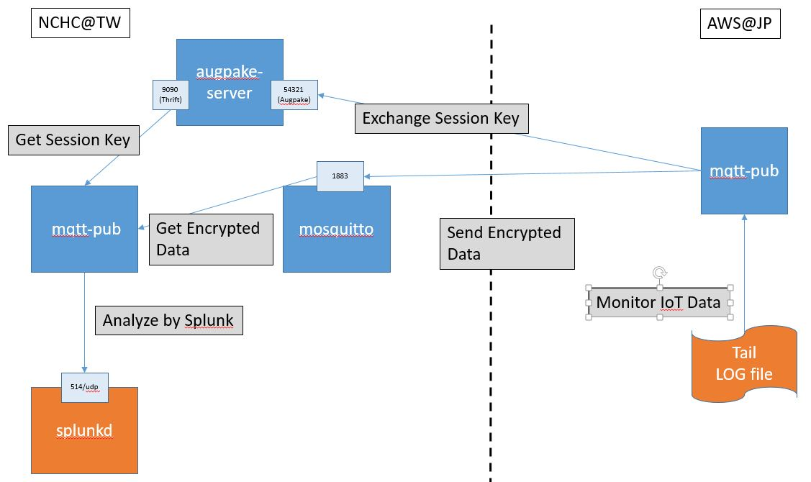

## Demo Architecture 



## Build MQTT Broker image

```
$ cd NCHC-AIST-Joint-Project/dockerization/docker-mosquitto
$ docker build --no-cache -t jllopis/mosquitto:v1.4.10 .

$ sudo docker run --rm -ti -v `pwd`/mosquitto.conf:/etc/mosquitto/mosquitto.conf \
  --name broker \ 
  -p 1883:1883 -p 9883:9883 \ 
  jllopis/mosquitto:v1.4.10  
```

## Build Common images for NCHC-AIST joint project
```bash
$ cd NCHC-AIST-Joint-Project/dockerization
$ sudo docker build -t nchc-aist:base -f ./Dockerfile-base .
```

## Build & run wrapper AugPAKE server image 
```bash
$ cd NCHC-AIST-Joint-Project/dockerization/docker-augpaker-server
$ sudo docker build -t nchc-aist:augpake-server -f Dockerfile ../../
$ docker run --rm -p 54321:54321 -p 9090:9090 --name augpake-server nchc-aist:augpake-server 54321
```

## Build & run mqtt publisher  
Build: 
```
$ /NCHC-AIST-Joint-Project/dockerization/docker-mqtt-pub
$ sudo docker build -t nchc-aist:mqtt-pub -f ./Dockerfile ../../
```

For Demo:
```
# Modify configuration for publisher

$ vim docker-mqtt-pub/config.py
# For mqtt-pub.py
  WATCH_FILE = "/dionaeaIOT.txt"

# AugPAKE server configuration
# For mqtt-pub.py
  AUGPAKE_SERVER_IP = "140.110.113.134"
  AUGPAKE_SERVER_PORT = "54321"

# MQTT broker configuration
# For mqtt-sub.py & mqtt-pub.py
  MQTT_BROKER_IP = "140.110.113.134"
  
$  sudo docker run -ti --rm --name pub \ 
   -v `pwd`/config.py:/tmp/mqtt-python/config.py \ 
   -v /opt/honeynet/dionaeaIOT.txt:/dionaeaIOT.txt \ 
   nchc-aist:mqtt-pub
```


For local test:
```
$ docker run -ti --rm --name pub \
  --link augpake-server:augpake-server \
  --link broker:broker \ 
  -v `pwd`/config.py:/tmp/mqtt-python/config.py \
  -v /var/log/auth.log:/var/log/auth.log \
  nchc-aist:mqtt-pub
```

## Build & run mqtt subscriber
  Build: 
  ```
  $ cd NCHC-AIST-Joint-Project/dockerization/docker-mqtt-sub
  $ sudo docker build -t nchc-aist:mqtt-sub -f ./Dockerfile ../../
  ```
  For Demo: 
  ```
  # Modify configuration for publisher
  $ docker-mqtt-sub/config.py
  
  # usedocker bridge ip if test in docker
   SYSLOG_SERVER_IP = "140.110.113.134"
   INFLUXDB_SERVER_IP = "influxdb"

  # influxdb_client | Syslog | default_print
    OUTPUTTYPE = "influxdb_client"

  
  $ docker run -ti --rm --name sub \ 
    --link augpake-server:augpake-server \ 
    --link broker:broker \
    --link influxdb:influxdb \
    -v `pwd`/config.py:/tmp/mqtt-python/config.py \ 
    nchc-aist:mqtt-sub
  ```
  
  For local test:
  ```
  $ docker run -ti --rm --name sub \
    --link augpake-server:augpake-server \
    --link broker:broker \
    --link influxdb:influxdb \
    -v `pwd`/config.py:/tmp/mqtt-python/config.py 
    nchc-aist:mqtt-sub 
  ```
  
## Run influxdb container
   For Demo:
   ```
   $ docker run --name influxdb -p 8083:8083 -p 8086:8086 -p 25826:25826/udp -v $PWD/influxdb:/var/lib/influxdb -v $PWD/influxdb.conf:/etc/influxdb/influxdb.conf:ro -v $PWD/types.db:/usr/share/collectd/types.db:ro influxdb:1.0
   ```

## Run Grafana Container
   For Demo:
   ```
   $ docker run --name grafana -p 3000:3000 -v $PWD/grafana:/var/lib/grafana --link influxdb -e "GF_INSTALL_PLUGINS=grafana-worldmap-panel,grafana-piechart-panel" grafana/grafana:3.1.1
   ```